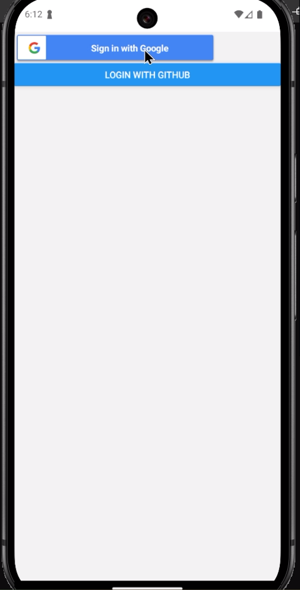
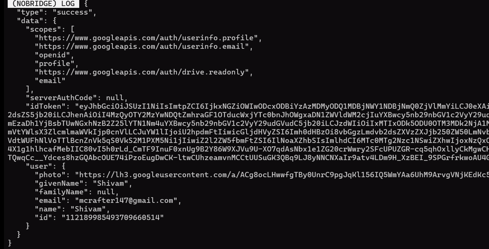
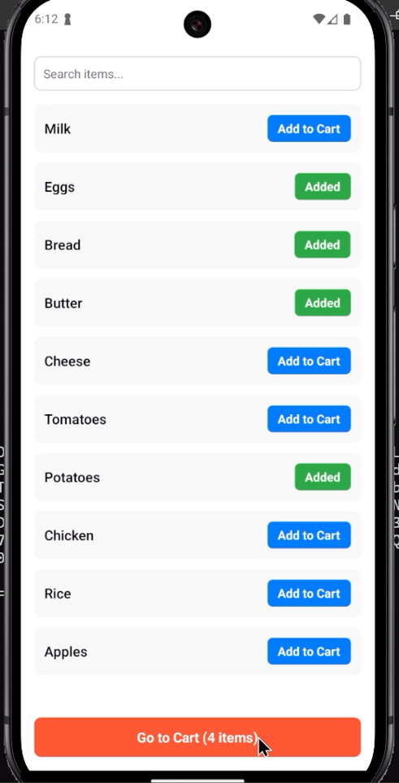
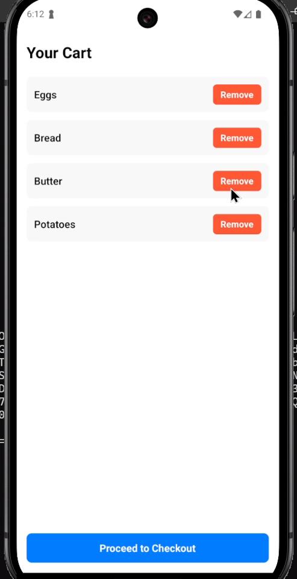
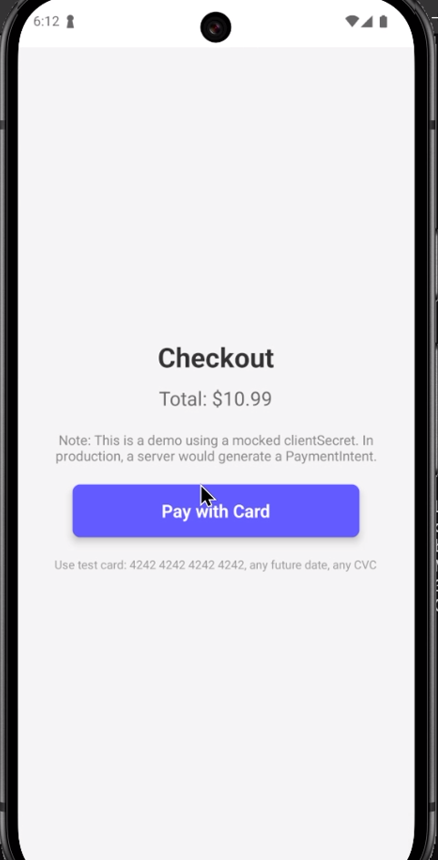
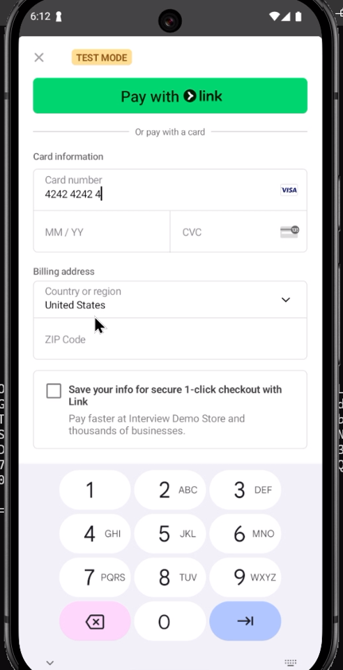

# 🍔 Food Cart App – Final Interview Round 🚀

This is a **React Native (Expo)** app built for the **final interview round**, showcasing smooth onboarding, authentication, global state management, and seamless payments.  

---

## ✨ Features

### 📱 Core Functionality  
✅ **Onboarding Screen** – Interactive **Swiper** for a smooth introduction.  
✅ **Authentication** – Secure login via **Google & GitHub OAuth 2.0**.  
✅ **Home Screen** – Browse a **list of food items**, with **search & filter**.  
✅ **Cart System** – Add/remove food items dynamically.  
✅ **Redux Toolkit** – Global state management for real-time updates.  
✅ **Persistent Auth** – User data stored in **AsyncStorage** for session management.  
✅ **Navigation** – **Stack Navigation** ensures smooth screen transitions.  

### 💳 Payments  
💰 **Stripe Test API** for seamless checkout.  
💳 Use **4242 4242 4242 4242** (Test Card) for transactions.  
🔄 **New Payment Intent** generated via **Axios** for every checkout.  
✅ **Successful payments** redirect users **home** and **clear the cart**.  

---

